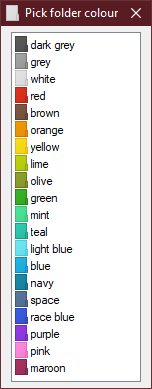

# coloured-folders

Colourise Windows 10 folders from the context menu

## Requirements

To run the program, you will need Windows 10.  
To compile the program, you will need [AutoHotkey](https://autohotkey.com) installed and added to your `%PATH%`.

## Usage

Running:

1. Download the latest release from the [releases page](https://github.com/ABS96/coloured-folders/releases)
1. Run `Installer.exe`

Compiling:

1. Run `compile.cmd`
1. Install the program using the generated `Installer.exe`

## Notes

It takes a little time for the system to notice that the icon has changed.

The uninstaller script is not entirely functional yet.  
To remove the program, run the uninstaller, then remove the following folders manually:

- `%LocalAppData%\ABS\ColouredFolders`
- `%AppData%\Microsoft\Windows\Start Menu\Programs\Coloured Folders`
